> :man_technologist: I am thrilled to share my MSc dissertation project, for which I was awarded a distinction with an impressive mark of 83. </h3>

<h2 align="left"> Incorporating EPC Data and Socioeconomic Factors for Improved Data-Driven Carbon Emission Prediction in Domestic Buildings.</h2>

> Project Overview

Building industry contributes around 40% of global carbon emissions (CEs), making it one of the major factors in climate change. It is important to understand the factors that influence CEs and develop accurate predictive models for achieving net-zero goals. This study incorporates data-driven approaches to analyse the correlations between various factors and CEs and identifies the most effective feature selection (FS) methods and Machine Learning (ML) models.

> Key Objective
This project would like to:
* explore the relationships between building characteristics, socioeconomic factors, and carbon emissions.
* Identify effective feature selection methods to reduce input dimensionality while maintaining accuracy.
* Optimise ML models using ensemble learning techniques to provide actionable insights for policymakers.

>Datasets
* Energy Performance Certificate (EPC): Provides building-specific characteristics and carbon emission data for Leeds.
* Index of Multiple Deprivation (IMD): Scores for income and education domains, showing socioeconomic variations.
* Hours Worked: Data on working hours, showing potential economic activity and its impact on carbon emissions.

>Methodology [under updating]

```mermaid
graph TD;
    Data_Preprocessing-->Cleaning["Cleaning, normalisation, and handling missing values"];
    Data_Preprocessing-->Merging["Merging EPC data with socioeconomic datasets using geospatial references (LSOA codes)"];
    Data_Preprocessing-->Feature_Engineering["Feature engineering using one-hot encoding for categorical variables"];
    Cleaning-->Feature_Selection;
    Merging-->Feature_Selection;
    Feature_Engineering-->Feature_Selection;
    Feature_Selection-->FS["Recursive Feature Elimination (RFE), Random Forest (RF), and Mutual Information (MI) methods were applied to identify significant features"];
    FS-->Model_Development;
    Model_Development-->first_step["ML algorithms including Random Forest (RF), Gradient Boosting (GBR, XGBoost), LightGBM, and CatBoost were developed"];
    Model_Development-->second_step["Models were evaluated using R² and CVRMSE."];
    Model_Development-->third_step["Bayesian optimisation and ensemble learning techniques (e.g., weighted and voting averaging) were used to enhance performance."];
```

>Findings
* Building characteristics such as floor area, insulation quality, and heating systems significantly influence CEs.
* Socioeconomic factors like income and education levels also play a vital role.
* RFE was the most effective FS method, significantly improving model accuracy.
* Ensemble learning using XGBoost and RF models optimised through Bayesian techniques provided the best predictions.
